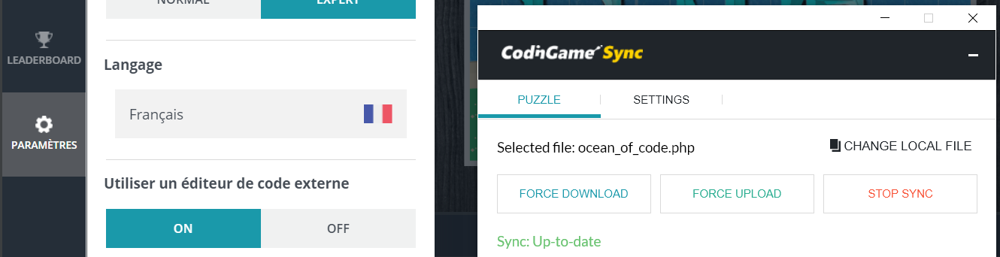
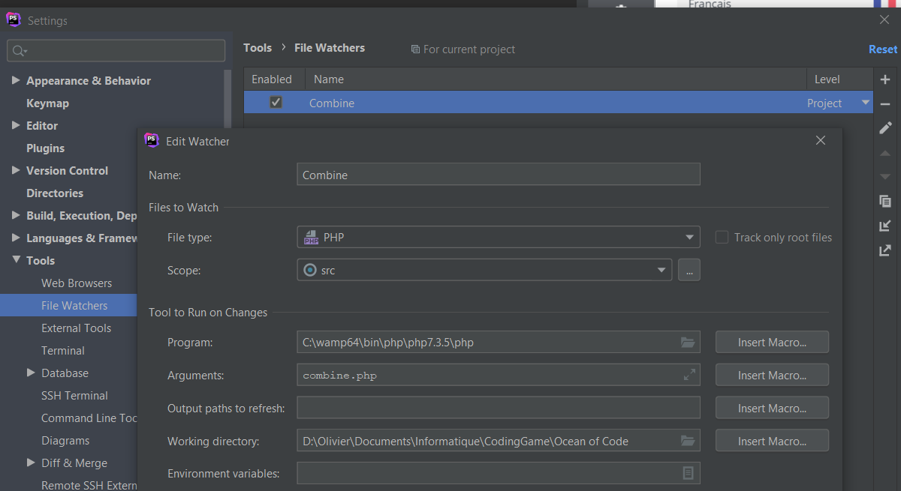
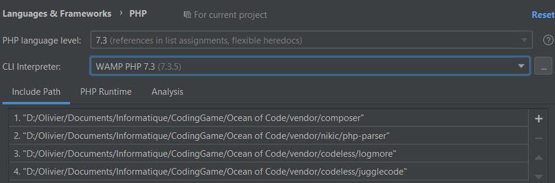
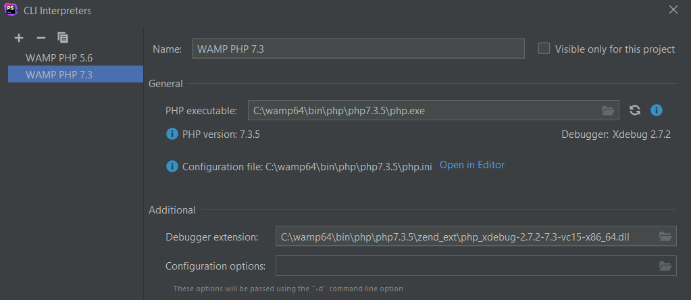

# Coding Games - Ocean of Code

## Basic usage

### Installation

Run `composer install`

### Edit your code

Place your source files in the `src` folder  

The main file is `src/app.php` which contains the autogenerated PHP code from Coding Game,
a bit modified with 3 empty classes (Map, Player, and Game) required as example.

### Combine all sources files into one

Execute `php combine.php`  
All sources files included from `src/app.php` will be combined in `dest/ocean_of_code.php`  

### Sync with Coding Game

Use the Coding Game Chrome plugin to sync with `dest/ocean_of_code.php`:

## Advanced usage with PhpStorm

### Automatise the combination with PhpStorm

In **Tools > Filewatcher**, set a custom Filewatcher:

You must give the full path of your PHP executable, and the full path of the project as working directory.

Now when you modify a source file, the combined file will be regenerated automatically !

### Testing

If you want to implement some tests and run them with PhpStorm, you also also set your PHP interpreter in **Langages and Frameworks > PHP**:

### PhpStorm tips

You should exclude `dest` and `vendor` folders to avoid indexing their content

### Note
I haven't exclude the `.idea` folder from repository so you can just adapt my PhpStorm configuration for you own instead of setting it from scratch.
